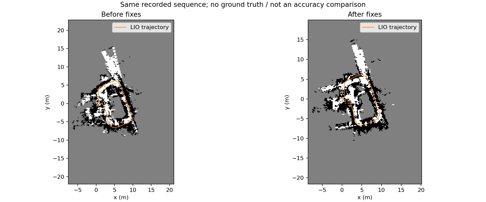
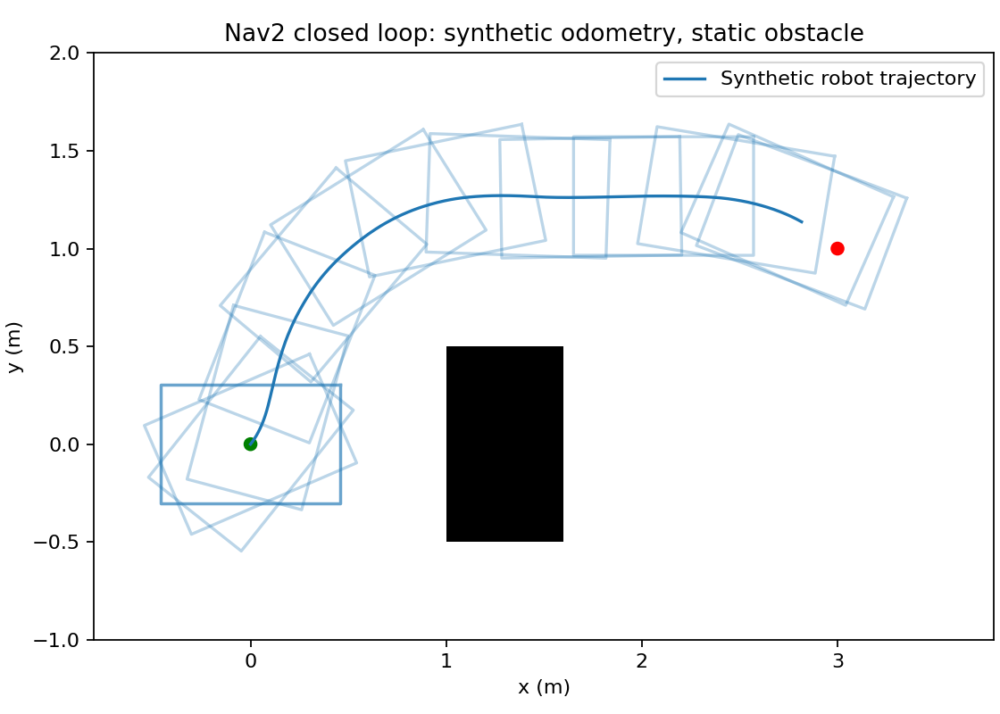

# 2026-09-08 修复与验证报告

本次修复基于上游提交 `fbfc7d59202fa3e80b140e3e557016ec8b71b5fe`，在 Ubuntu 22.04 / ROS 2 Humble / x86_64 WSL2 上完成测试。结果支持软件接口接入，不代表已完成 M20 Pro 或其他机器狗的真机验收，也不证明与原厂二进制算法等价。

## 修复范围

| 问题 | 修复 |
|---|---|
| IMU 加速度未更新速度 | 恢复世界系速度积分 |
| 轮速强行覆盖世界 x 坐标 | 改为时间区间内的平面 twist 观测；修正世界位置误差与机体增量的雅可比 |
| 无效轮速使有效 LiDAR 更新失效 | 观测有效性独立，分别组合信息矩阵 |
| 连续扫描丢失辅助里程计边界样本 | 保留前驱和未来样本，拒绝缺少区间覆盖或间隔过大的数据 |
| 关键帧点云/位姿外参不一致 | LiDAR 点云转换一次到 IMU 系，供回环、栅格和导图使用 |
| 过期点云导致点云/时间队列错位 | 所有 LiDAR 接口一致拒绝过期或重复时间戳 |
| 导航缺少连续里程计、速度和 TF 链 | 新增可标定的 `/odom`、`/ODOM`、body-frame twist 和 `map→odom→base_link`，使用测量时间戳 |
| 延迟定位结果与最新里程计错配 | 按相同时刻的历史里程计计算全局校正 |
| 自定义 PGM 解码/占据语义错误 | 使用 Nav2 的 YAML/PGM 加载器保留像素类别、行序、分辨率和原点 |
| 构建和启动问题 | 修复 CMake 链接模式、安装路径、gflags 对 ROS launch 参数的解析；增加空地图保存检查 |

新增的 Nav2 路径与仓库原有 Hybrid A*/DWA 自研导航分开启动。M20、通用 RoboSense 配置默认关闭辅助里程计，启用前须满足 [输入坐标、时间与标定约定](ROBOT_DEPLOYMENT.md)。

## 测试结果

| 检查 | 结果 |
|---|---|
| 编译 | lightning、leg_wheel_odom、m20_navigation 通过；无 drdds 的开发机跳过 SDK 相关功能 |
| SLAM 回归 | 11/11，通过加速度、无效观测、数值雅可比、时间区间、连续样本保留、外参及导航输出测试 |
| core/leg 工作空间汇总 | 49 个报告条目，0 错误/失败，7 跳过；包含框架/lint 条目，不是 49 个独立算法场景 |
| 原生导航接口 gtest | 7/7；不含 drdds 硬件交互 |
| 栅格桥 | 3×2 非对称二进制图得到 `[0,100,-1,100,0,-1]`；0.17 m 分辨率及 `(2.3,-4.7,0.3 rad)` 原点正确 |
| 离线建图 | 397 次 LIO 更新，143,035 点；45.30 秒录制约 6.48 秒处理完成 |
| 同图定位 | 149/149 次尝试成功，内部 confidence 均值 2.944 |
| 在线建图 | 377 条连续/校正里程计，754 个 TF；速度非零，输出时间严格递增，保存地图成功 |
| 在线定位 | 387 条连续、382 条校正里程计，769 个 TF；预期 TF 链存在 |
| 安装后 launch | 建图和定位启动通过；短 bag 经 launch 回放得到 14 条里程计、28 个 TF，保存成功 |
| 导出地图 + Nav2 静态规划 | 112 个路径点、11.27 m；398 个中心线采样无占据/越界；地图像素映射无误 |
| Nav2 合成闭环 | goal 成功；位置距离 0.229 m，yaw -0.267 rad，满足 0.25 m / 0.30 rad 容差；最大指令 0.3 m/s、0.4 rad/s；943 个采样位姿无加边距足迹碰撞 |

导航包全量 lint 尚未通过：版权、cpplint、flake8、pep257、uncrustify 五类检查在原始快照也均失败。修复后的最终汇总为 295 条报告记录、244 条失败、36 条跳过，不能表述为“全仓库测试全绿”。新增 ROS launch 文件的单独 flake8 检查通过。

代码结构与功能需求分别经过独立审查。审查发现的轮速区间边界丢失问题已修复，并增加连续扫描回归；最终增量审查未发现新的实质问题。

## 数据与解释范围

数据为 [DeepRoboticsLab/lightning-lm-deep-robotics](https://github.com/DeepRoboticsLab/lightning-lm-deep-robotics) 提供的 office 记录：452 条 PointCloud2、8,301 条 IMU，总长约 45.30 秒，文件 SHA-256 见 [完整性记录](validation/2026-09-08/bag_integrity.json)。录制不含真值或辅助里程计；53 个过期 LiDAR 时间戳被拒绝，定位的点云/时间队列清空告警为零。

修复前/后轨迹长度约 37.13 / 36.69 m，端点距离约 0.492 / 0.498 m。**这些数值不是 ATE，也不能证明绝对建图精度提升。** 同图定位不是独立精度或泛化测试。轮速融合由回归测试覆盖，尚无真机接触/打滑数据验证。



合成 Nav2 测试使用真实 Nav2 服务和控制器，但机器人运动学、TF、里程计与障碍地图均为合成，未接入 SLAM 或动态障碍点云。继承的 DWB 参数在此场景出现停滞，最终配置采用 [Humble Regulated Pure Pursuit](https://api.nav2.org/nav2-humble/html/md_nav2_regulated_pure_pursuit_controller_README.html)。这仅是一个静态场景，不能据此宣称真机导航成功率。



## 复现

按 [README](../README.md) 构建并加载 `install/setup.bash`，运行回归：

```bash
colcon test --packages-select lightning leg_wheel_odom m20_navigation
colcon test-result --verbose
```

离线复现使用 [测试配置](validation/2026-09-08/offline_config.yaml)，从独立可写目录运行，地图写入该目录的 `data/new_map`：

```bash
ros2 run lightning run_slam_offline --config /absolute/offline_config.yaml --input_bag /absolute/office_bag
ros2 run lightning run_loc_offline --config /absolute/offline_config.yaml --input_bag /absolute/office_bag --map_path ./data/new_map
```

Nav2 合成闭环脚本从仓库根运行。依赖 Humble Nav2、Cyclone DDS 及 Python numpy、PyYAML、Pillow、matplotlib；脚本使用本地 ROS domain 91，结果写入 `data/validation/nav2`，不会调用厂商 SDK：

```bash
python3 scripts/validation/nav2_closed_loop_probe.py
python3 scripts/validation/check_nav2_fixture.py
```

该脚本明确关闭动态障碍层，仅测试静态地图控制闭环；实机配置保留 PointCloud2 障碍层。

## 机器狗部署尚需完成

- 目标平台的 ARM/Foxy 或其他实际 ROS 版本构建与运行测试。
- LiDAR/IMU 编码、单位、同步、外参及地面高度标定；完整运动腿足包络测量。
- 实际 `/cmd_vel` 或厂商 SDK 的速度、步态/模式、停止及超时接口适配。
- 真机低速目标、停止、障碍物与掉线测试，以及独立真值数据的精度评估。

仓库自研规划器的原生 DrDDS 桥不是已验证的 Nav2→M20 命令转换器。没有硬件数据或接口信息时，不应把当前软件测试结论当作最终部署验收。

原始数值证据位于 [validation/2026-09-08](validation/2026-09-08)。
